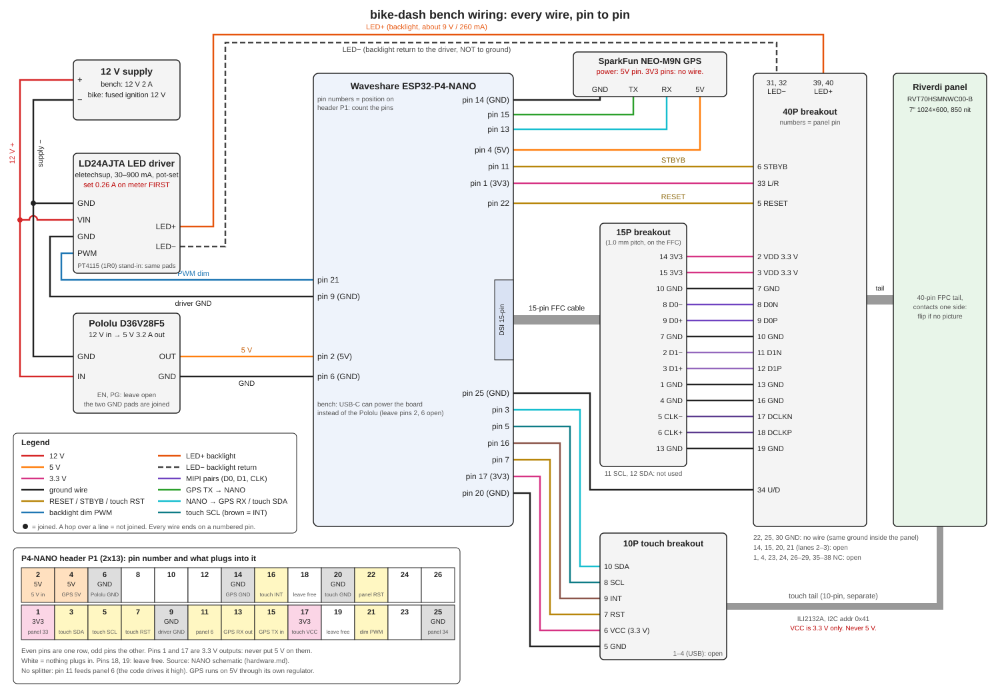

# Wiring guide (bench build)

Written for someone who is not a wiring person. Every connection is listed pin by pin. Do the steps in order and do not skip the checks; the panel is the expensive part and the backlight is the one thing that can cook it.

## What you are building



Same thing as text, for when the picture is too small on a phone:

```
                 +---------------------+          +--------------------------+
 12 V supply --->| Pololu D36V28F5     |--5 V---->| Waveshare ESP32-P4-NANO  |
    (bench:      | (12 V in, 5 V out)  |          |   15-pin DSI connector   |----15-pin FFC----> [15P breakout]
     wall wart;  +---------------------+          |   GPIO header            |                          |
     bike: fused                                  +--------------------------+                    6 short jumpers
     ignition 12 V)                                    |  GPIO27 (reset)  GPIO26 (dim)  3V3  GND        |
         |                                             |     |               |          |    |           v
         |       +---------------------+               |     |               |          |    |     [40P breakout] <--panel tail-- Riverdi 7" panel
         +------>| LD24AJTA LED driver |---LED+ / LED- ------------------------------------------------> pins 39/40 and 31/32
                 | (12 V in, 270 mA CC)|<-- DIM from GPIO26
                 +---------------------+
```

Three groups of wires:
1. **Power**: 12 V to the Pololu and the LED driver; 5 V from the Pololu to the P4-NANO; 3.3 V from the P4-NANO to the panel; one shared ground.
2. **Control**: panel RESET from GPIO27, LED driver PWM from GPIO26, panel STBYB tied to 3.3 V.
3. **Video**: six MIPI wires (three pairs) from the P4-NANO's DSI connector to the panel. These are the only fussy ones.

## Tools

Multimeter, small flat screwdriver for the terminal blocks, wire strippers, a pack of female-female Dupont jumpers (100 mm), tweezers for the FPC latches, a 12 V 2 A supply.

## Step 0. Board alone, no panel (Stage 0 in software.md)

1. Plug the P4-NANO into the PC over USB-C. Nothing else connected.
2. Flash `esphome/bike-dash-nodisplay.yaml` (the same config without the `display:` block).
3. Confirm the log shows the C6 radio coming up and Wi-Fi connecting. If this does not work, nothing else matters yet. (Done 2026-09-28; the board now runs `bike-dash-live.yaml`.)

## Step 1. Set the LED driver current before it ever touches the panel

The backlight driver is an eletechsup LD24AJTA (AliExpress, "DC 6-24V 30-900mA Adjustable LED Driver"). Its current is set by a small pot, up to a ceiling of 0.1 V / RCS (the board's sense resistor). It can reach 900 mA, which will destroy the backlight, so it is set on a meter first. The pads are bare: solder six wires (VIN, GND, LED+, LED-, PWM, GND).

1. Meter: red probe in the **10A** jack, dial on 10A DC. The mA jack is often fused at 200 mA.
2. Turn the pot fully toward **decrease** (arrows are printed next to it).
3. 12 V to VIN / GND. Red probe on **LED+**, black on **LED-**, nothing else on the output. PWM open (floating = full on).
4. Power on. Turn the pot slowly toward increase until the meter reads **0.26 A**. Do not go past **0.27 A**: the panel datasheet gives 270 mA as the working current and its absolute maximum is 30 mA per LED string x 9 strings = 270 mA, so there is no headroom above it.
5. Power off, remove the meter. The setting holds whatever the load is.

If it stops rising around 0.10 A, RCS is too big (1 ohm = 100 mA ceiling); it needs 0.33 ohm or less.

The old PT4115 modules (Amazon 3-pack) came with a 1R0 sense resistor = 100 mA, about 37 % brightness. Usable for a dim bench test only.

## Step 2. Power wiring

All terminal blocks: strip 6 mm, insert, tighten, tug-test.

| From | To | Wire |
|---|---|---|
| 12 V supply + | Pololu **VIN** | red |
| 12 V supply - | Pololu **GND** | black |
| Pololu **VOUT** (5 V) | P4-NANO header pin labelled **5V** | red |
| Pololu **GND** | P4-NANO header pin labelled **GND** | black |

Check with the meter before going on: Pololu VOUT to GND reads **4.9-5.1 V**. If it reads 12 V you wired VIN and VOUT backwards. Power off.

On the bench you can skip the Pololu and just use USB-C for the P4-NANO. You still need 12 V for the LED driver.

### LED driver, pad by pad

The driver board has two pads on one edge (**LED+**, **LED-**) and four on the other (**GND**, **VIN**, **GND**, **PWM**). The two GND pads are the same connection: one takes the supply, the other takes the P4-NANO ground. The old PT4115 (1R0) module has the same pads and wires the same way.

| Driver pad | Goes to | Wire |
|---|---|---|
| **VIN** | 12 V supply + | red |
| **GND** (next to VIN) | 12 V supply - | black |
| **GND** (next to PWM) | P4-NANO header **GND** (pin 6 or 9) | black |
| **PWM** | P4-NANO header **GPIO26** (pin 21) | blue |
| **LED+** | panel pins 39 and 40 (Step 3) | red |
| **LED-** | panel pins 31 and 32 (Step 3). Never to ground. | black |

The driver needs 12 V: it cannot light the backlight from 5 V. If the P4-NANO runs from USB-C, the GND-to-GND wire above is what gives the PWM signal its return path, so do not skip it.

## Step 3. Panel side: the 40-pin breakout

1. Open the black latch on the 40-pin breakout's FPC socket (flip up or slide out, depending on the model).
2. Slide the panel's tail in **contacts facing the contacts in the socket**. The Riverdi tail has contacts on one side only; if the picture stays dead later, this is the first thing to flip.
3. Close the latch. Pin 1 of the tail is marked on the panel's drawing; the breakout has "1" printed at one end. Make sure they line up, or every pin below is off by one.

Now wire the breakout's header pins. Pin numbers are the **panel** pin numbers (they match the breakout's printed numbers when pin 1 lines up):

| Breakout pin | Panel signal | Goes to | Wire |
|---|---|---|---|
| 2 **and** 3 | VDD 3.3 V | P4-NANO header **3V3** (use one jumper to pin 2 and a second from pin 2 to pin 3, or a Y) | red |
| 5 | RESET | P4-NANO header **GPIO27** | yellow |
| 6 | STBYB | P4-NANO header **3V3** (same 3.3 V as above) | red |
| 7, 10, 13, 16, 19, 22, 25, 30 | GND | P4-NANO header **GND** (at least two of them; the more the better) | black |
| 33 | L/R (scan direction) | P4-NANO header **3V3** | red |
| 34 | U/D (scan direction) | P4-NANO header **GND** | black |
| 31 **and** 32 | LED- | LED driver **LED-** | black |
| 39 **and** 40 | LED+ | LED driver **LED+** | red |
| 8 | D0N | 15-pin breakout, DSI **D0-** (Step 4) | pair 1 |
| 9 | D0P | 15-pin breakout, DSI **D0+** | pair 1 |
| 11 | D1N | 15-pin breakout, DSI **D1-** | pair 2 |
| 12 | D1P | 15-pin breakout, DSI **D1+** | pair 2 |
| 17 | DCLKN | 15-pin breakout, DSI **CLK-** | pair 3 |
| 18 | DCLKP | 15-pin breakout, DSI **CLK+** | pair 3 |
| 1, 4, 23, 24, 26-29, 35-38 | NC | **nothing** | |
| 14, 15, 20, 21 | lanes 2-3 | **nothing** (the P4 is 2-lane) | |

Pins 33 and 34 are inputs with nothing on the panel holding them, so they must be wired. 33 to 3.3 V and 34 to GND is the normal picture (top to bottom, left to right), the same as Riverdi's own reference circuit. Swap either one to flip the picture that way.

The header has two 3V3 pins (P1 pins 1 and 17) and five GND pins (6, 9, 14, 20, 25). You will run out of 3V3 pins: join the 3.3 V wires on the perfboard or with a Y jumper.

LED driver PWM: one wire from the driver **PWM** pad to P4-NANO header **GPIO26** (pin 21), plus the driver's second **GND** pad to a header **GND** pin (table in Step 2).

## Step 4. Video side: the 15-pin breakout on the P4-NANO

The P4-NANO's DSI socket (J1, marked "15PIN--PI4B" on the schematic) is a **15-pin 1.0 mm** FPC, the same as the display socket on a Raspberry Pi 4. The 15-pin FFC cable that ships in the NANO box goes from the NANO to a 15-pin 1.0 mm breakout; then six jumpers go from the breakout to the 40-pin breakout (table in Step 3).

The 22-pin 0.5 mm breakout and 22-pin FFC bought earlier do not fit this board. They are not used.

Pinout, read from the P4-NANO schematic (confirmed 2026-10-01):

| 15-pin pin | Signal | Goes to (40-pin breakout) | Wire |
|---|---|---|---|
| 1 | GND | | |
| 2 | DSI D1- | pin **11** (D1N) | pair 2 |
| 3 | DSI D1+ | pin **12** (D1P) | pair 2 |
| 4 | GND | | |
| 5 | DSI CLK- | pin **17** (DCLKN) | pair 3 |
| 6 | DSI CLK+ | pin **18** (DCLKP) | pair 3 |
| 7 | GND | pin **7** or **10** (GND) | black |
| 8 | DSI D0- | pin **8** (D0N) | pair 1 |
| 9 | DSI D0+ | pin **9** (D0P) | pair 1 |
| 10 | GND | pin **13** or **16** (GND) | black |
| 11 | I2C SCL (GPIO8) | **nothing** | |
| 12 | I2C SDA (GPIO7) | **nothing** | |
| 13 | GND | | |
| 14, 15 | 3.3 V | **nothing** (panel 3.3 V comes from the header) | |

Meter check before wiring (board powered **off**): the cable can leave the breakout's printed numbers running backwards. Put one probe on the P4-NANO header **3V3** pin and find the two breakout pins that beep. Those are pins 14 and 15. If they are the pins printed 1 and 2, the numbering is reversed: use 16 minus the printed number for every row above. Then confirm pins 1, 4, 7, 10 and 13 beep to a header **GND** pin.

If the cable will not seat or nothing beeps, the contacts are facing the wrong way at one end; flip that end over.

Rules for the six video jumpers:
- Same length, as short as you can (100 mm max on the bench).
- Keep each pair's two wires twisted together or taped side by side.
- Do not run them next to the 12 V wires.

Cables: use the 15-pin cable from the NANO box first. The uxcell 10-pack (100 mm, ordered 2026-10-01) is the spare; its contact side was not stated in the listing, so check it seats contacts-to-contacts at both ends.

## Step 4a. Touch (10-pin tail)

The touch tail is a separate 10-pin 0.5 mm FPC from the small board on the back of the panel. It goes into the 10-pin breakout. Pin numbers are the tail's (datasheet section 11.2).

| Tail pin | Signal | Goes to | Wire |
|---|---|---|---|
| 5 | I2C GND | P4-NANO header **GND** | black |
| 6 | I2C VDD | P4-NANO header **3V3**. **Never 5 V on this pin.** | red |
| 7 | RST | P4-NANO header **GPIO23** (P1 pin 7) | yellow |
| 8 | SCL | P4-NANO header **GPIO8** (P1 pin 5) | white |
| 9 | INT | P4-NANO header **GPIO22** (P1 pin 16) | brown |
| 10 | SDA | P4-NANO header **GPIO7** (P1 pin 3) | green |
| 1, 2, 3, 4 | USB path (GND, 5 V, D-, D+) | **nothing** | |

The breakout has a 2x5 header. Which header pin is which tail pin has to be read off the board's printing (or beeped out) when it arrives.

Check: with it wired and the board running, the log's I2C scan should list a device at **0x41**. Nothing shows the touch points yet; the driver is not written (software.md Stage 6).

## Step 4b. GPS (speed source)

The P4-NANO has no dedicated GPS header; any two free header GPIOs become a UART. The config uses **GPIO20 = P4 TX (P1 pin 13), GPIO21 = P4 RX (P1 pin 15)** (change the `gps_tx_pin` / `gps_rx_pin` substitutions if those are taken on the silkscreen).

Four wires. TX goes to RX and RX goes to TX; that is the one everybody gets backwards.

| GPS pin (SparkFun NEO-M9N) | Goes to | Wire |
|---|---|---|
| **3V3** | P4-NANO header **3V3**. **Not 5V: this board is 3.3 V only and 5 V will kill it.** | red |
| GND | P4-NANO header **GND** | black |
| TX (GPS talks) | P4-NANO header **GPIO21** (P1 pin 15, P4 RX) | green |
| RX (GPS listens) | P4-NANO header **GPIO20** (P1 pin 13, P4 TX) | white |

(If the Matek M9N-5883 was bought instead: its 5V pin goes to the header **5V**, and its RX/TX pins wire the same way. Its UART is 3.3 V logic too.)

No level shifting needed either way. Keep the antenna (the square ceramic patch) facing the sky with nothing metal on top of it; on the bike that means the top of the enclosure, not under the panel.

### One-time GPS setup (do this on the PC before wiring it to the P4)

Factory default is 1 update per second at 9600 baud, which makes a laggy speedo. We want 10 per second at 115200.

1. Connect the GPS to the USB-TTL adapter with the adapter's switch on **3.3 V**: 3V3-3V3, GND-GND, GPS TX to adapter RX, GPS RX to adapter TX. (If the SparkFun board's USB-C port shows up as a COM port on the PC, use that instead and skip the adapter.)
2. Install u-blox **u-center** (free, Windows). Connect at 9600 (Matek: 38400).
3. View > Messages View > UBX > CFG > RATE: set Measurement Period **100 ms**, click Send.
4. UBX > CFG > PRT: UART1, baud **115200**, Send. Reconnect u-center at 115200.
5. UBX > CFG > CFG: tick "Save current configuration", all devices (BBR + Flash if offered), Send.
6. Power-cycle the module and reconnect at 115200. If it is still at 10 Hz / 115200, done. If it forgot, the module has no flash or battery for settings: uncomment the `on_boot` block in the YAML, which re-sends the same settings every time the dash powers up.

The three UBX command strings the `on_boot` block sends (widely used values, verify against u-center's "Send" hex dump if in doubt):

| Purpose | Bytes |
|---|---|
| 10 Hz (CFG-RATE 100 ms) | `B5 62 06 08 06 00 64 00 01 00 01 00 7A 12` |
| 115200 baud (CFG-PRT UART1) | `B5 62 06 00 14 00 01 00 00 00 D0 08 00 00 00 C2 01 00 07 00 03 00 00 00 00 00 C0 7E` |
| Save (CFG-CFG) | `B5 62 06 09 0D 00 00 00 00 00 FF FF 00 00 00 00 00 00 17 31 BF` |

Test: with the dash running, the log prints satellites, speed and course from the `gps:` component. Outdoors it needs 30-90 s for a first fix; indoors near a window maybe, in a basement never.

## Step 5. Power-on order and first test

1. Meter check, power off: panel pin 2 to any GND must **not** be a short. Panel pin 39 to pin 31 must not be a short.
2. Power the 12 V supply. LED driver output is now live but nothing is drawn yet (it is fine; it is a current source, open circuit is safe).
3. Plug USB-C into the P4-NANO (or turn on the Pololu 5 V).
4. Flash the config **with** the `display:` block. Expect: backlight comes on (Stage 1), screen shows green with a grey box.

| Symptom | Check |
|---|---|
| Backlight off | GPIO26 jumper; DIM floating should mean full on, so if it is still off the LED driver has no 12 V or LED+/- are swapped |
| Backlight on, screen black, no errors in the log | Reset wire (GPIO27 to pin 5); STBYB tied to 3.3 V; panel tail inserted contacts-down vs contacts-up; THS_ZERO note in hardware.md; then try `0xB2, 0x10` in place of `0xB2, 0x50` in the init sequence (Espressif's value for this chip) |
| Picture jumps or will not hold still | THS_ZERO (hardware.md): the datasheet names exactly this symptom |
| Log shows DSI errors | A pair swapped, or a pair to the wrong lane; try swapping + and - of one pair, then lanes 0 and 1 |
| Scrambled or rolling picture | `lane_bit_rate` (try 800 or 1000 Mbps), then `pclk_frequency` |
| Picture mirrored or upside down | panel pin 33 (L/R) or 34 (U/D): move that wire between 3V3 and GND. Also the result of leaving them unconnected. |
| Panel gets hot | stop; check the LED driver current (Step 1) |
| I2C scan shows nothing at 0x41 | touch tail seated and the right way up; pin 6 has 3.3 V; SDA and SCL not swapped |

## Step 6. Bike install (later)

Same connections, but: the two breakouts and jumpers become a carrier PCB, the 12 V comes from a fused ignition-switched feed, the Pololu EN pin follows the ignition, and everything lives in the enclosure with the panel. Do not put jumper wires on a motorcycle.
